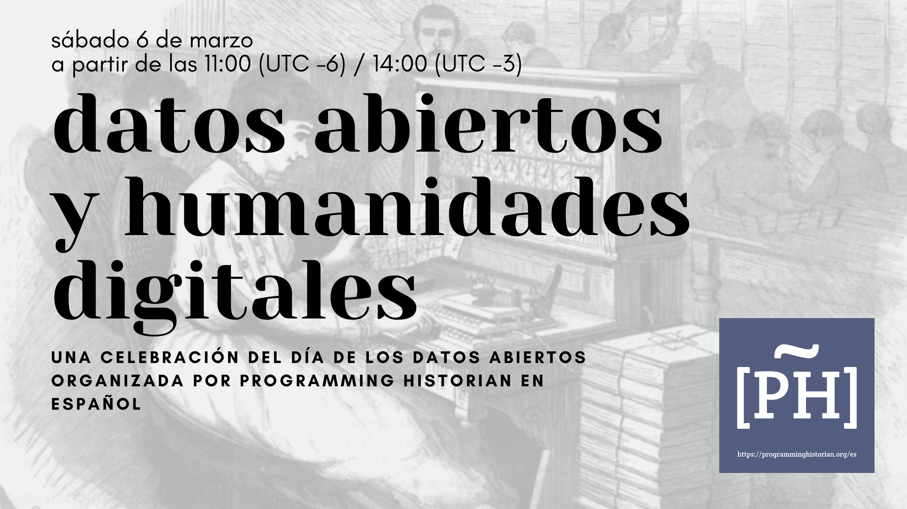
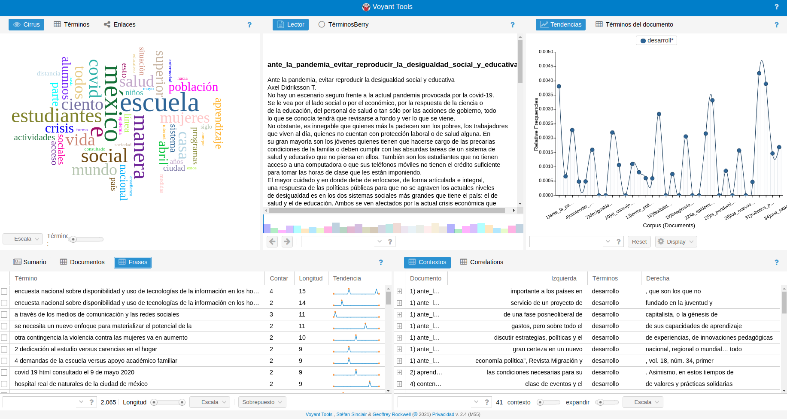
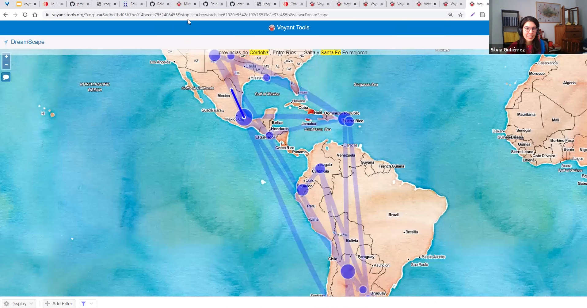
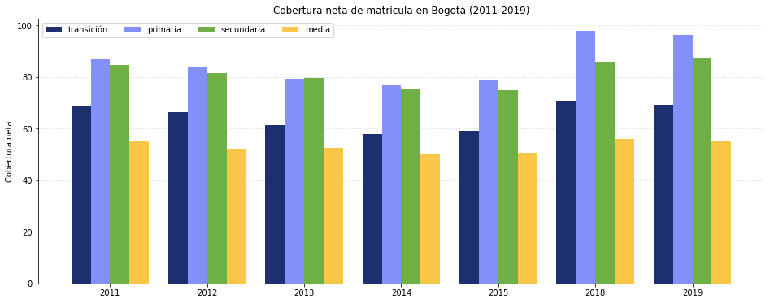
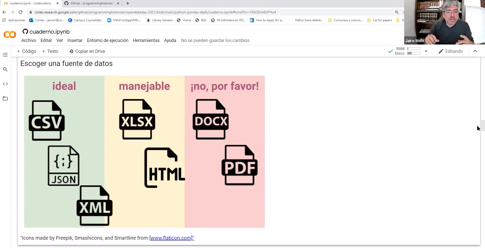

# Día de los Datos Abiertos 2021
Repositorio con los materiales del evento "Datos Abiertos y Humanidades Digitales" realizado en el marco de la celebración del Día de los Datos Abiertos 2021. Este evento fue organizado por el equipo editorial de [Programming Historian en Español](https://programminghistorian.org/es/equipo-de-proyecto#programming-historian-en-espa%C3%B1ol) y recibió el apoyo de la [Open Knowledge Foundation](https://blog.okfn.org/2021/02/12/meet-the-organisations-receiving-open-data-day-2021-mini-grants/). 

## Bloque 1: Análisis de textos con Voyant Tools - Silvia Gutiérrez

Aprende a hacer “lectura distante” (ganar una vista de pájaro sobre muchos textos con herramientas computacionales) con una herramienta que no requiere instalación: Voyant Tools. En este taller usaremos como base el tutorial de Programming Historian en español [Análisis de corpus con Voyant Tools](https://doi.org/10.46430/phes0043) y mostraremos cómo adaptarlo para analizar otro corpus abierto de textos.

### Sobre la tallerista

Silvia Gutiérrez De la Torre estudió la maestría de Humanidades Digitales en la Universidad de Wurzburgo y en el King’s College de Londres. Es co-fundadora de RLadiesCDMX y voluntaria de Wikipedia y Wikidata porque quiere pensar que compartir es el verbo que sustituirá a tener. Durante cinco años trabajó como la primera Bibliotecaria de Humanidades Digitales en El Colegio de México donde impartió diversos talleres sobre el uso de herramientas y la aplicación de métodos computacionales para las Humanidades y Ciencias Sociales. Actualmente está por comenzar su doctorado en la Universidad de Leipzig y el Max Planck para la Historia de la Ciencia.

### Vínculos importantes

#### Voyant Tools

:wrench: En línea

* Página principal Voyant Tools: [voyant-tools.org](https://voyant-tools.org/)
* [Espejos](https://voyant-tools.org/docs/#!/guide/mirrors) (o sea, sitios que contienen réplicas de algún software o página web)

:computer: Local

* [Descargar la última versión de Voyant Tools Server (M45)](https://github.com/sgsinclair/VoyantServer/releases/tag/2.4.0-M45) (:warning:aunque me ha dado algunos problemas en Windows)
* :white_check_mark: Alternativo: [descargar la versión más estable del Voyant Tools Server (M28)](https://github.com/sgsinclair/VoyantServer/releases/tag/2.4.0-M28)
* Las instrucciones para correr tu propio servidor están [aquí](https://digihum.mcgill.ca/voyant/resources/run-your-own/voyant-server/) (¡ojo! El servidor del blog aparece como "no seguro") | también pueden seguir las instrucciones de [este video](https://www.youtube.com/watch?v=8e7M8NqGyF4)

#### Corpus

Para esta lección podrás usar una colección de textos que fue "parseada" a partir de una publicación compartida con licencia CC BY 4.0:

#### Materiales de apoyo

* Este taller está basado en tres fuentes principales:
  * la lección de Programming Historian en español [Análisis de corpus con Voyant Tools](https://doi.org/10.46430/phes0043) existe una breve introducción a cómo preparar un corpus histórico y algunas de las funciones básicas de VT.
  * [Dialogica: Thinking-Through Voyant (DTTV)](https://sgsinclair.github.io/dialogica/) un libro de texto gratuito creado por los desarrolladores de VT para aprender sobre el análisis de texto asistido por computadora con Voyant y Spyral. Las lecciones están vivas, para comentarios escribir a grockwel (arroba) ualberta.ca
  * El libro _Hermeneutica: Computer-Assisted Interpretation in the Humanities_ (MIT Press, 2016), el cual contiene cuatro [capítulos interactivos](http://hermeneuti.ca/) que demuestran las posibilidades de analizar un corpus con la ayuda de VT.
* La [documentación de VT](https://voyant-tools.org/docs/#!/guide/start) es muy útil también para comprender mejor cada una de las herramientas ofrecidas por este software aunque no está tan actualizada

#### Un vistazo al entorno de trabajo en Voyant Tools

### Video del taller

📺 En este enlace encontrarás [el registro del evento](https://puc.zoom.us/rec/share/5tJm4_rjMBHmZ7GdNW4L0g_6rSgTLkqKdt-l19Dg1keRIlkOximbo023guCQ3ECg.LEkxoKLdubMF6YWB?startTime=1615051517000) (faltan los primeros 7 minutos)

## Bloque 2: Visualización de datos abiertos con Python >> Pandas >> Dash - Jairo Melo

En este taller aprenderemos a descargar, procesar y visualizar datos abiertos con Python, Pandas y Dash. Utilizaremos la herramienta Jupyter Notebook para hacer los ejercicios, por lo que no es necesario realizar instalaciones de software. No importa si no cuentas con conocimientos previos en lenguajes de programación o bases de datos: en el taller aprenderemos algunas estrategias sencillas para hacer tareas complejas con datos abiertos en Python. 

### Sobre el tallerista
Jairo es Doctor en historia de El Colegio de Michoacán de México, maestro y licenciado en Historia de la Universidad Industrial de Santander en Colombia. En la actualidad es jefe de desarrollo MOOC en la Coordinación de Universidad Abierta, Innovación Educativa y Educación a Distancia de la UNAM.

### Jupyter Notebook

Para ejecutar el notebook en que se basa este taller hay dos opciones.

#### Google Colab (es necesario tener una cuenta de Google)

1. Ir a la dirección https://colab.research.google.com/
2. Seleccionar la pestaña GitHub
3. Ingresa la URL correspondiente al repositorio creado en el GitHub de Programming Historian >> Open Data Day: https://github.com/programminghistorian/opendataday-2021
4. Seleccionar el notebook de la ruta `python-pandas-dash/cuaderno.ipynb`
5. Para ejecutar las casillas será necesario autenticarse con una cuenta de Google. La primera vez que trates de ejecutar aparecerá el siguiente mensaje: "Advertencia: Google no creó este bloc de notas". Haz clic en "Ejecutar de todos modos".

#### Binder
(Es probable que se encuentren algunos bugs y se tarde un poco en cargar.)

1. Ir a la dirección https://mybinder.org/
2. En la casilla "GitHub repository name or URL" escribir la dirección de este repositorio: https://github.com/programminghistorian/opendataday-2021 
3. Ejecutar en el botón "launch"
4. Abrir el directorio `python-pandas-dash`
5. Abrir el archivo `cuaderno.ipynb`

### Datos
Para este taller utilizaremos datos sobre educación preescolar, básica y media por departamento en Colombia. Esta información la obtuvimos del [Portal de Datos Abiertos del Gobierno de Colombia](https://www.datos.gov.co/Educaci-n/MEN_ESTADISTICAS_EN_EDUCACION_EN_PREESCOLAR-B-SICA/ji8i-4anb).

Este conjunto de datos contiene los principales indicadores de los niveles preescolar, básica y media discriminados por Departamento desde el año 2011 hasta 2019 definitiva oficial. Este set de datos se puede relacionar con el de matrícula en educación preescolar, básica y media donde se presenta la caracterización de los estudiantes que permiten obtener información para comprender el comportamiento de los indicadores

### Material de apoyo

* [Lecciones sobre Python publicadas por Programming Historian](https://programminghistorian.org/es/lecciones/?topic=python)
* [pandas documentation](https://pandas.pydata.org/pandas-docs/stable/index.html)
* [plotly open source graphing libraries](https://plotly.com/python/)
* [dash open-source](https://dash.plotly.com/)

#### Bibliografía adicional

* McKinney, Wes. *Python for data analysis: data wrangling with pandas, NumPy, and IPython*. Second edition, O’Reilly Media, Inc, 2018.
* Pajankar, Ashwin. *Practical Python Data Visualization: A Fast Track Approach to Learning Data Visualization with Python*. 2021.
* Stepanek, y Suresh John. *Thinking in Pandas*. Apress, 2020. Open WorldCat, https://link.springer.com/10.1007/978-1-4842-5839-2.

#### Un vistazo a una de las visualizaciones que generaremos

### Video del taller

📺 En este enlace encontrarás [el registro del evento](https://puc.zoom.us/rec/share/Ez1zMsu6Ym88Ban8Hej1kacm2xkzA2Dzq2mAWB8KjywC0jk2VJH1arTYXwpzpnRJ.elBwkEDS-9G6vhCz?startTime=1615064717000)

